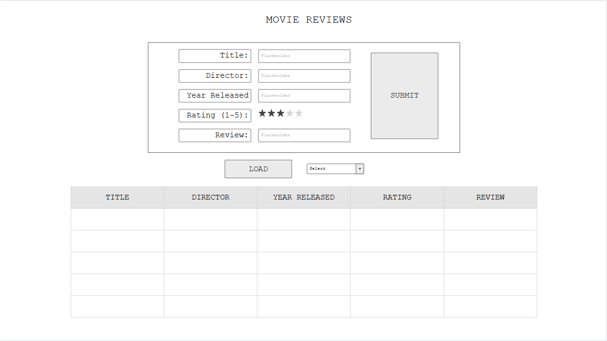

# Movie Rating App

## Project Spec

Everybody wants to be a critic, as humans we can't seem to help it. I particularly love analyzing and reviewing movies of any kind, wether its just for my own personal amusement or to impress my friends and family with my insane amounts of movie knowledge (no one else cares). I also appreciate a level of organization when looking at a list such as this so that I can easily identify key bits of trivia about movies. Since I feel this way about movies, I'm sure there are others out there who feel the same and would appreciate a no nonsense way to easily get their pesky criticisms out of there head. This simple web app takes user input from several forms to store data about movies that a user can rate out of 5 stars. The user can enter a movie title, director's name, year the movie was released and their personal rating (1:5)/5 stars which will be a selection of star icons. A brief review/comment about the movie can also be submitted. The user can also choose to display a table of previous entries. The table will have a column for each data element for the movie including the users review. The table can be sorted alphabetically by title, or by directors name, or can be sorted by rating, or year released. The default method will be alphabetically by title. The user can also display tables that only show movies by a certain director or by a certain rating. Each input for the table will contain a button for deleting the submission and will reload the table upon selection. All of the users input; title, director's name, release year, rating and review, will be stored on an AWS server to be displayed in the table until deleted. This web app is great for anyone who wants to keep a list of movies they've reviewed. Some stretch goals for this app would be to add images or image input for submission of movie posters for the specific movie. Or to add a section in the table that generates a quote from the movie. 

## Project Wireframe

